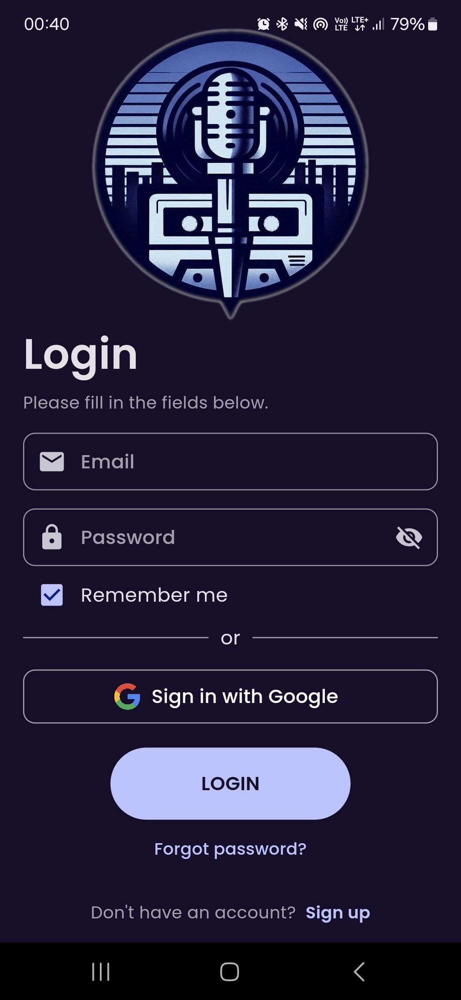
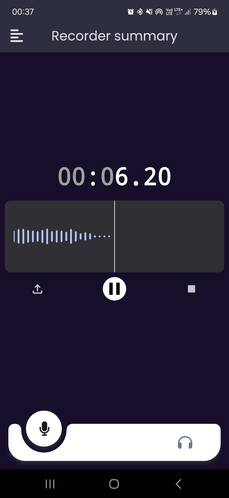
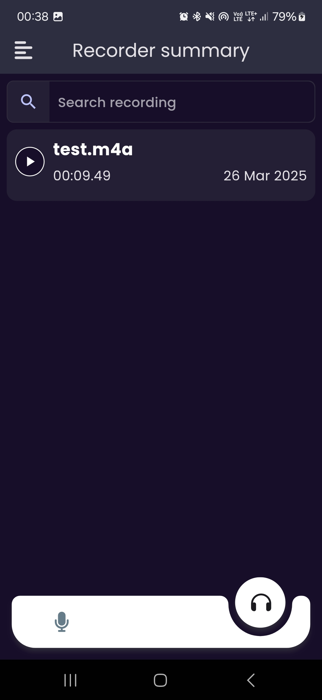

<h3 align="center">Recorder Summary</h3>

  

    The Summary Recorder App is an intuitive mobile application designed for recording, managing, and securely storing audio recordings directly on your device. With seamless integration of authentication powered by Firebase, users can confidently access and manage their recordings securely.

Key Features:

<ul>
  <li>Audio Recording: Easily record high-quality audio directly on your mobile device.</li>
  <li>Local Storage: Securely save and manage your recordings locally for quick access and privacy.</li>
  <li>Firebase Authentication: Robust authentication system supporting email/password login.</li>
  <li>User-Friendly Interface: Simple, intuitive UI that enhances user experience.</li>
</ul>

<table align="center">
  <tr>
    <td align="center">
      
    </td>
    <td align="center">
      
    </td>
    <td align="center">
      
    </td>
  </tr>
  <tr>
    <td align="center">Login Screen</td>
    <td align="center">Home Screen</td>
    <td align="center">Recordings Screen</td>
  </tr>
</table>
<h3>Technical Details:</h3>

    The Recorder Summary app is built using Flutter (version 3.19.6), a powerful framework for building natively compiled mobile applications. This allows the app to be available on both iOS and Android platforms, providing a seamless experience across devices.

